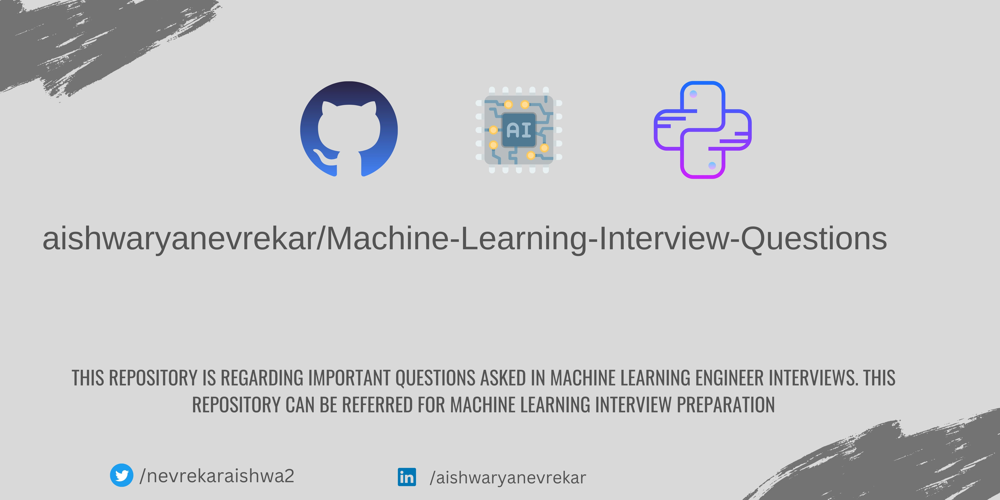

# 🔥🔥Machine-Learning-Interview-Questions🔥🔥

| Sr No | Name                                                         | Link                                                                  |
| ----- | ------------------------------------------------------------ | --------------------------------------------------------------------- |
| 1     | ML Interview Questions 1.1                                   |https://medium.com/@dishitaneve/ml-interview-questions-1-1-2c14c4dcdf18|
| 2     | Most Asked AI/ML Interview Questions in India                |https://medium.com/@springboard_ind/most-asked-ai-ml-interview-questions-in-india-6db723cc7578|
| 3     | Machine Learning Interview Questions                         |https://mecha-mind.medium.com/machine-learning-screening-interview-questions-4b35be855827|
| 4     |20 Essential Machine Learning Interview Questions             |https://medium.com/swlh/20-essential-ml-questions-answered-6bf61f8b1aa6|
| 5     |Crack the top 40 machine learning interview questions         |https://grokkingtechinterview.com/crack-the-top-40-machine-learning-interview-questions-b385f550a695|
| 6     |Interview resources : ML/Data Science/AI Research Engineer    |https://purvanshimehta.medium.com/interview-resources-ml-data-science-ai-research-engineer-4703518d208e|
| 7     |ML Interview questions and answers                            | https://gunjanagicha.medium.com/ml-interview-questions-and-answers-b339c6dd12da|
| 8     |A Guide To Machine Learning Interview Questions And Answers   |https://medium.com/edureka/machine-learning-interview-questions-a5aef8a3ca60    |
| 9     | Top 6 Machine Learning Algorithms                            |https://afrozchakure.medium.com/top-6-machine-learning-algorithms-44db10129c66  |
| 10    |Machine learning interview preparation — ML algorithms        |https://medium.com/@marizombie/machine-learning-interview-preparation-ml-algorithms-1e1eba78194c|
| 11    |Machine Learning IP - EDUREKA -Questions and Answers          |https://www.youtube.com/watch?v=t6gOpFLt-Ks&ab_channel=edureka%21               |
| 12    |100 Common Interview Questions on ML                          |https://www.youtube.com/watch?v=yA_Vtygj5FA                                     |
| 13    |Machine Learning Interview Questions-Krish Naik               |https://www.youtube.com/watch?v=mlumJPFvooQ&list=PLZoTAELRMXVM0zN0cgJrfT6TK2ypCpQdY|
